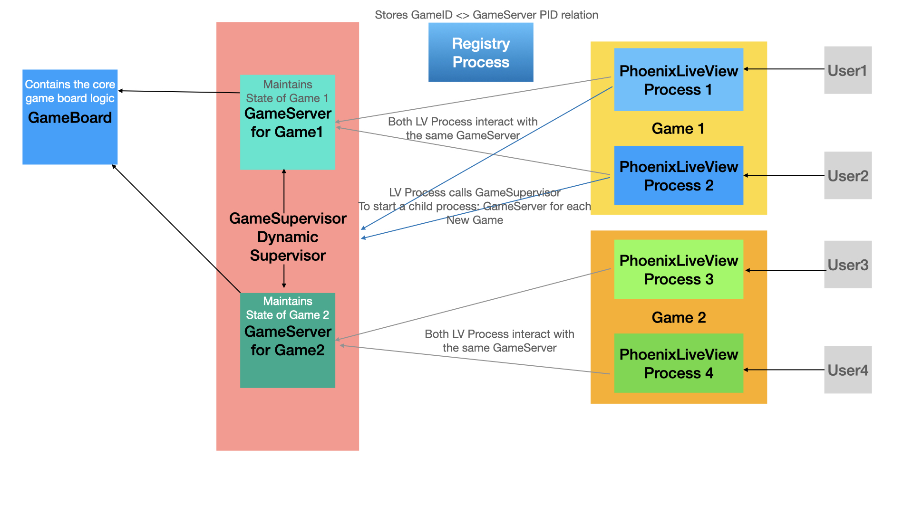

# 2048 using Phoenix Live View

To run the game locally:

1. Clone this repository (obviously!)
2. Run `mix setup` to download Elixir and Nodejs dependencies
3. Run `mix phx.server` to start the Phoenix Server

Now you can visit [`localhost:4000`](http://localhost:4000) from your browser to play the game.

## Control Flow

## Game behaviour and implementation in various scenarios

Scenario 1: A user wants to start a game.
1. User goes to http://localhost:4000
2. Since there is no Game ID in the URL params, LV generates a new Game ID and redirects the user and a new game is started upon redirect.

Scenario 2: A user wants to join a game.
1. User gets a link with Game ID to join the game.
2. User visits the link and the LV process checks for the Game ID in the Registry and gets the active GameServer pid of the game.
3. Since the GameServer process is managing the game state and LV is only displaying this state and relaying commands from the user to this GameServer pid, the displayed board is a shared one between all users joining the game.

Scenario 3: GameServer gets shutdown when the user leaves the game
1. For every game, there is a GameServer (GenServer) process started by a Dynamic Supervisor.
2. When the user quits the LV page, we capture the terminate event and stop the corresponding GameServer if no other user is playing the game (in a multiplayer environment). This avoids stale GameServer sitting around forever.

Scenario 4: When the user joins a game with the link, the GameServer had already stopped running.
1. User A invites User B with a link to the game.
2. Before User B joins the game, User A has quit the game.
3. Since there is no other player active, GameServer is stopped. When User B joins the game, a message is displayed that the game has ended and an option to start a new game is provided.

## Features

1. Play solo or play with any number of people sharing the same board.
2. Play on mobile using touch keys or use keyboard on desktop.
3. Bored to keep moving tiles? Use autoplay and watch the game playing itself. (but why would you do that??)
4. Chat with other team members.

